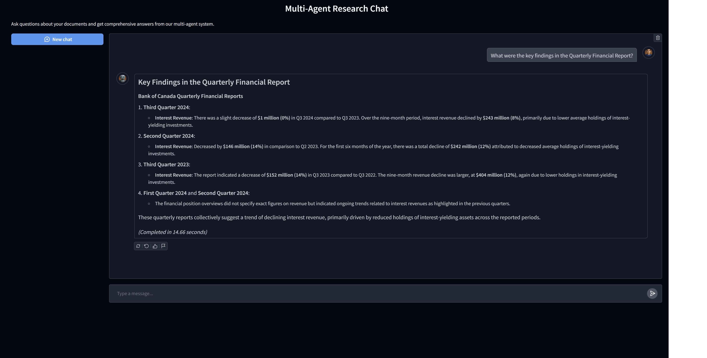
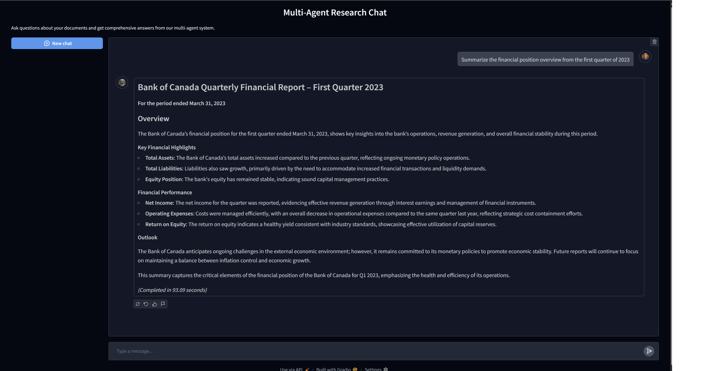
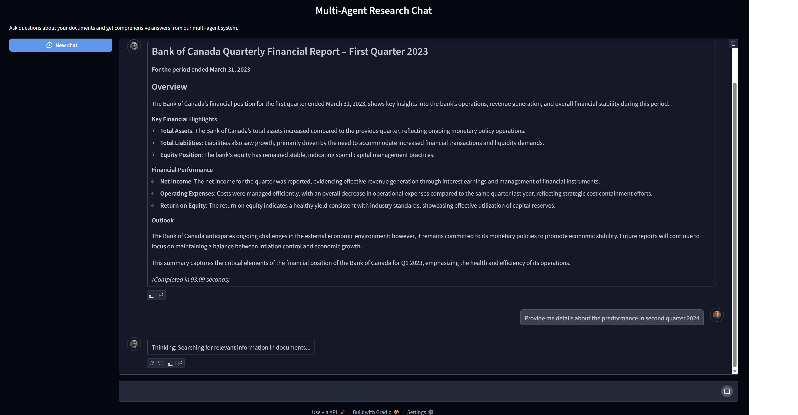

# Multi-Agent Research Chat

A modular Streamlit application that implements a multi-agent chatbot for document research and information retrieval. This project demonstrates performance-optimized Streamlit development patterns and a dual-agent approach for high-quality responses.

## Features

- **Multi-Agent Architecture**: Uses a specialized Analyst agent for research and a Reviewer agent for quality control
- **Document Processing**: Loads and processes markdown files into a searchable knowledge base
- **Vector Search**: Utilizes ChromaDB for efficient semantic search
- **Optimized Streamlit UI**: Implements caching and performance best practices
- **Modular Structure**: Clean separation of concerns for easy maintenance and extension

## Project Structure

```
multi-agent-chat/
├── src/
│   ├── document_processing/   # Document loading and chunking
│   ├── vector_store/          # Vector database management
│   ├── agents/                # Agent and crew definitions
│   ├── tools/                 # Agent tools (search, clarification)
│   ├── ui/                    # Streamlit UI components
│   └── utils/                 # Utilities for caching and state management
├── app.py                     # Main Streamlit application
├── requirements.txt           # Project dependencies
└── README.md                  # Project documentation
```

## Performance Optimizations

This project implements several performance optimizations for Streamlit:

1. **Strategic Caching**
   - Function results cached with appropriate TTLs
   - Resource-heavy objects (like vector stores and agent crews) cached with `@st.cache_resource`
   - Data processing results cached with `@st.cache_data`
   - Custom caching implemented with `TTLCache` from `cachetools`

2. **State Management**
   - All session state management centralized in `SessionState` utility class
   - Static methods used to avoid instance creation overhead
   - Special handling for file uploader state preservation

3. **UI Rendering**
   - Container reuse for minimizing re-rendering
   - Empty placeholder containers for dynamic UI updates
   - Progressive rendering for long-running processes
   - Error recovery mechanisms

4. **Network and Processing Optimization**
   - Batch document processing with progress indicators
   - Modular file handling for efficient upload management

## Installation

1. Clone the repository:
   ```
   git clone <repository-url>
   cd multi-agent-chat
   ```

2. Create and activate a virtual environment:
   ```
   python -m venv venv
   source venv/bin/activate  # On Windows: venv\Scripts\activate
   ```

3. Install the dependencies:
   ```
   pip install -r requirements.txt
   ```

4. Create a `.env` file with your API keys:
   ```
   OPENAI_API_KEY=your_openai_api_key
   ```

## Usage

1. Run the Streamlit app:
   ```
   streamlit run app.py
   ```

2. Upload markdown documents to create a knowledge base
3. Ask questions about the uploaded documents
4. The Analyst agent will search for relevant information and compose a response
5. The Reviewer agent will refine the answer for accuracy and clarity

## Screenshots

Here are some screenshots of the application in action:

### Document Processing

*The document processing interface allows you to upload markdown files and build your knowledge base.*

### Chat Interface

*The chat interface with multi-agent responses provides detailed information with references from your documents.*

### Search Results

*Example of a detailed research response with information extracted from the knowledge base.*

## Extending the Application

- **Adding New File Types**: Extend the `document_processing` module to support additional file formats
- **Additional Agents**: Create new agent types in the `agents` module
- **Custom Tools**: Add new agent tools in the `tools` module
- **UI Enhancements**: Add or modify components in the `ui` module

## License

This project is licensed under the MIT License - see the LICENSE file for details. 